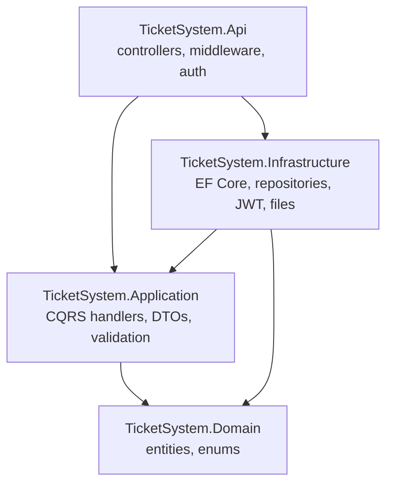

# Ticket Management System

A full-stack ERP-style ticketing platform: raise tickets, route them through a workflow, collaborate with comments, and keep an eye on everything from a reporting dashboard. Built as a portfolio project to show a clean, production-shaped architecture end to end.


---

## What's inside

- **Authentication & RBAC** — register / login / forgot + reset password, JWT auth, and three roles (Admin, Manager, Employee) with permissions enforced on both the API and the UI.
- **Ticket lifecycle** — create, edit, assign / reassign, move through `Open → In Progress → On Hold → Resolved → Closed`, reopen, and delete. Ticket numbers (`TKT-00001`) are generated by the database.
- **Collaboration** — public comments, staff-only internal notes, file attachments, and a full activity timeline per ticket.
- **Dashboard** — totals, open/closed/high-priority/overdue counts, a six-month created-vs-resolved trend, status and priority breakdowns, and an employee performance table.
- **Reports** — tickets by status / priority / employee, monthly trend, and one-click **CSV / Excel** export.
- **Built-in niceties** — Swagger docs, global exception handling, structured logging, request validation, dark mode, responsive layout, and Docker support.

## Tech stack

| Layer | Choices |
|-------|---------|
| Frontend | Next.js 15 (App Router), TypeScript, Tailwind CSS, shadcn-style UI, TanStack Query, Recharts |
| Backend | ASP.NET Core 8 Web API, MediatR (CQRS), FluentValidation, Serilog |
| Data | PostgreSQL (Supabase-friendly), Entity Framework Core 8, Npgsql |
| Auth | JWT bearer tokens, BCrypt password hashing, role-based authorization |

## Architecture

The backend follows Clean Architecture. Dependencies point inwards — the domain knows nothing about the database or the web.



- **Domain** — entities and enums, no external dependencies.
- **Application** — one folder per feature, each with its commands/queries (MediatR), DTOs and validators. Cross-cutting concerns (validation, logging) run as pipeline behaviours.
- **Infrastructure** — EF Core `DbContext` + configurations, the repository / unit-of-work implementation, and the JWT, password-hashing, file-storage and export services.
- **Api** — thin controllers that just dispatch MediatR requests, plus auth, CORS, Swagger and the exception-handling middleware.

> Writes go through the repository + unit-of-work; reads are projected straight to DTOs with EF for efficiency. See [`docs/er-diagram.md`](docs/er-diagram.md) for the data model.

## Project structure

```
.
├── backend/                      # ASP.NET Core solution (Clean Architecture)
│   └── src/
│       ├── TicketSystem.Domain/
│       ├── TicketSystem.Application/
│       ├── TicketSystem.Infrastructure/
│       └── TicketSystem.Api/
├── frontend/                     # Next.js 15 app (App Router)
│   ├── app/                      # routes: (auth) + (app) groups
│   ├── components/               # UI primitives + feature components
│   ├── hooks/                    # React Query hooks
│   └── lib/                      # api client, auth, types
├── database/
│   ├── schema.sql                # full schema (generated from EF migration)
│   └── seed.sql                  # sample data for manual / Supabase setup
├── docs/
│   ├── er-diagram.md
│   ├── setup-guide.md
│   └── deployment-guide.md
└── docker-compose.yml
```

## Quick start (Docker)

The fastest way to see it running — Postgres, API and web in one command:

```bash
docker compose up --build
```

| Service | URL |
|---------|-----|
| Web app | http://localhost:3000 |
| API + Swagger | http://localhost:5080/swagger |
| PostgreSQL | localhost:5432 |

The API migrates and seeds the database on first start.

## Quick start (local, no Docker)

You'll need the **.NET 8 SDK**, **Node 18+**, and a **PostgreSQL** database (local or Supabase).

```bash
# 1. Backend
cd backend/src/TicketSystem.Api
#   set your connection string (appsettings.json or env var) then:
dotnet run            # → http://localhost:5080

# 2. Frontend (in a second terminal)
cd frontend
cp .env.example .env.local   # defaults to http://localhost:5080/api
npm install
npm run dev           # → http://localhost:3000
```

Full step-by-step (including Supabase) is in [`docs/setup-guide.md`](docs/setup-guide.md).

## Demo accounts

Seeded automatically on first run:

| Role | Email | Password |
|------|-------|----------|
| Admin | `admin@ticket.local` | `Admin@123` |
| Manager | `manager@ticket.local` | `Manager@123` |
| Employee | `employee@ticket.local` | `Employee@123` |

## Roles & permissions

| Action | Employee | Manager | Admin |
|--------|:--------:|:-------:|:-----:|
| Create tickets | ✅ | ✅ | ✅ |
| View all tickets | own / assigned | ✅ | ✅ |
| Edit ticket | own / assigned | ✅ | ✅ |
| Assign / reassign | — | ✅ | ✅ |
| Internal notes | own / assigned | ✅ | ✅ |
| Delete ticket | own | ✅ | ✅ |
| Manage categories | — | ✅ | ✅ |
| Manage user roles | — | — | ✅ |

## API at a glance

Base URL `…/api`. Explore everything in Swagger (`/swagger`).

| Area | Endpoints |
|------|-----------|
| Auth | `POST /auth/register`, `/auth/login`, `/auth/forgot-password`, `/auth/reset-password`, `GET /auth/me` |
| Tickets | `GET/POST /tickets`, `GET/PUT/DELETE /tickets/{id}`, `POST /tickets/{id}/assign`, `/status` |
| Collaboration | `GET/POST /tickets/{id}/comments`, `GET /tickets/{id}/activity`, `GET/POST /tickets/{id}/attachments` |
| Dashboard | `GET /dashboard/stats`, `/monthly`, `/status-breakdown`, `/priority-breakdown`, `/employee-performance` |
| Reports | `GET /reports/by-status`, `/by-priority`, `/by-employee`, `/monthly-trend`, `/export?format=csv\|excel` |
| Admin | `GET /users`, `PUT /users/{id}/role`, `GET/POST /categories` |

## Deployment

Designed to run on free tiers — **Vercel** (frontend) + **Render** (API) + **Supabase** (Postgres). The full walkthrough is in [`docs/deployment-guide.md`](docs/deployment-guide.md).

## License

[MIT](LICENSE)
