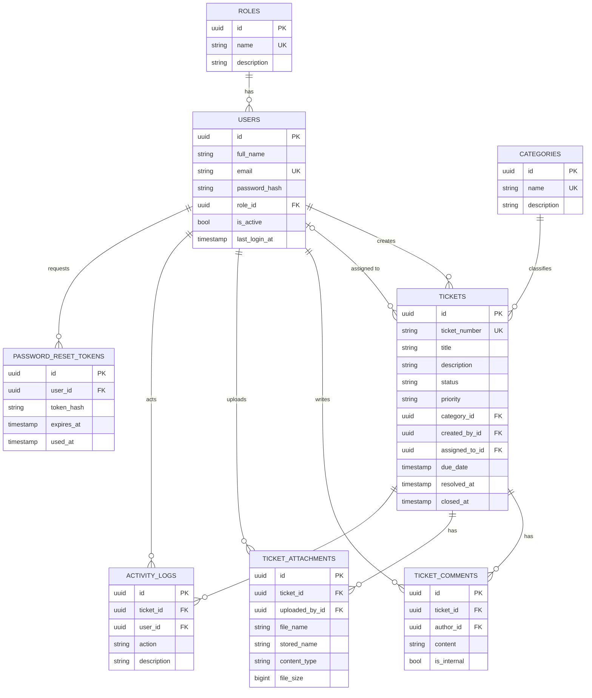

# Entity Relationship Diagram

The schema is created from the EF Core model (see [`database/schema.sql`](../database/schema.sql)). All tables use a `uuid` primary key plus `created_at` / `updated_at` audit columns.

## Relationships & rules

| From | To | Cardinality | On delete |
|------|-----|------------|-----------|
| Role → Users | one-to-many | a user has exactly one role | restrict |
| Category → Tickets | one-to-many | a ticket has one category | restrict |
| User → Tickets (created) | one-to-many | required | restrict |
| User → Tickets (assigned) | optional one-to-many | nullable | set null |
| Ticket → Comments / Attachments / Activity | one-to-many | | cascade |
| User → Comments / Attachments / Activity | one-to-many | author/uploader/actor | restrict |
| User → Password reset tokens | one-to-many | | cascade |

- `status` is one of `Open`, `InProgress`, `OnHold`, `Resolved`, `Closed`.
- `priority` is one of `Low`, `Medium`, `High`, `Critical`.
- `ticket_number` is generated by a database sequence as `'TKT-' || lpad(nextval('ticket_number_seq'), 5, '0')`.
- Cascading deletes from a ticket clean up its comments, attachments and activity; users can't be deleted while they own tickets (restrict), which keeps history intact.
